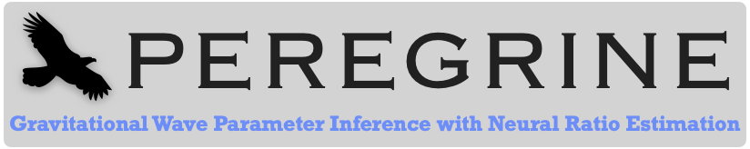

[](https://github.com/undark-lab/peregrine) [](https://arxiv.org/abs/2304.02035)
## Description

- **PEREGRINE** is a Simulation-based Inference (SBI) library designed to perform analysis on a wide class of gravitational wave signals. It is built on top of the [swyft](https://swyft.readthedocs.io/en/lightning/) code, which implements neural ratio estimation to efficiently access marginal posteriors for all parameters of interest.
- **Related paper:** The details regarding the implementation of the TMNRE algorithm and the specific demonstration for compact binary black hole mergers can be found in [arxiv:2304.02035](https://arxiv.org/abs/2304.02035).
- **Key benefits:** We showed in the above paper that PEREGRINE is extremely sample efficient compared to traditional methods - e.g. for a BBH merger, we required only 2% of the waveform evaluations than common samplers such as dynesty. The method is also an 'implicit likelihood' technique, so it inherits all the associated advantages such as the fact that it does not require an explicit likelihood to be written down. This opens up the possibility of using PEREGRINE to analyse a wide range of transient or continuous gravitational wave sources.
- **Contacts:** For questions and comments on the code, please contact either [Uddipta Bhardwaj](mailto:u.bhardwaj@uva.nl) or [James Alvey](mailto:j.b.g.alvey@uva.nl)
- **Citation:** If you use PEREGRINE in your analysis, or find it useful, we would ask that you please use the following citation.
- **Access:** Find out how to request access to PEREGRINE below!
```
@article{Bhardwaj:2023xph,
    author = "Bhardwaj, Uddipta and Alvey, James and Miller, Benjamin Kurt and Nissanke, Samaya and Weniger, Christoph",
    title = "{Peregrine: Sequential simulation-based inference for gravitational wave signals}",
    eprint = "2304.02035",
    archivePrefix = "arXiv",
    primaryClass = "gr-qc",
    month = "4",
    year = "2023"
}
```

 

----
## Accessing PEREGRINE

Currently, PEREGRINE is not a completely public repository, **however**, it is possible to **request access** to the full implementation as follows:
1. Complete the google form [Form: request access to PEREGRINE](https://forms.gle/PrQMebkKnAYqR4PS8) which will ask for your name, email, affiliation, and Github ID
2. You will then recieve a confirmation email (and a notification from Github) that we have added you to the private PEREGRINE repository
3. All installation instructions, descriptions of configuration setups, and full implementation of the TMNRE algorithm will be available 
4. You will also then be added to a mailing list where we announce future releases, bug fixes and updates. In addition you can support and raise issues here.

[](https://forms.gle/PrQMebkKnAYqR4PS8)

----
## Data availability

- To access data related to research involving PEREGRINE, please visit our [Zenodo](https://zenodo.org/communities/peregine/?page=1&size=20) community.
- [PEREGRINE: Sequential simulation based inference for gravitational wave signals (DATASET)](https://zenodo.org/record/7788596)
